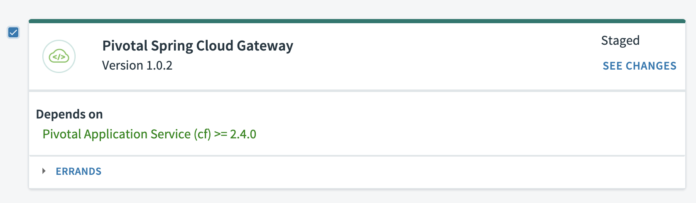

# Installing the Spring Cloud Gateway Tile

## Downloading the Spring Cloud Gateway Tile from PivNet

## Import the Tile into OpsMan

## Import the Tile into OpsMan and Apply Changes for that Tile

